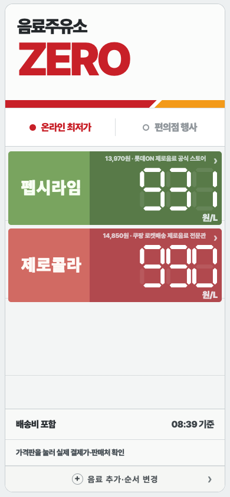
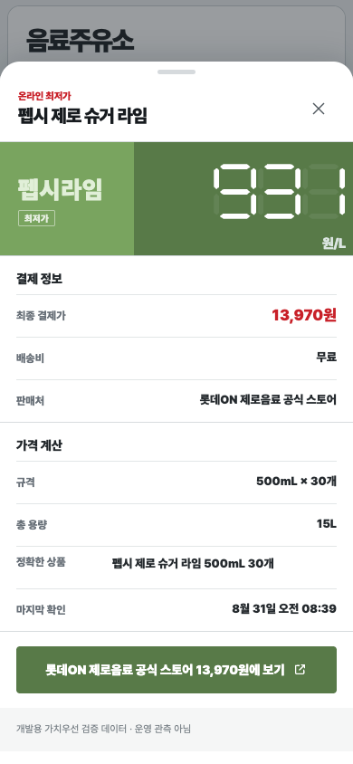
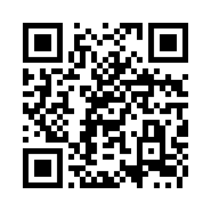

<h1 align="center">제로음료 주유소</h1>

<p align="center">
  <strong>음료 가격도, 주유소 가격판처럼.</strong><br>
  배송비와 행사 수량을 반영해 원/L로 비교하는 토스 미니앱
</p>

<p align="center">
  <a href="#price-check">가격 검증 사례</a> ·
  <a href="#run">코드 실행</a> ·
  <a href="docs/IMPLEMENTATION.md">데이터 흐름</a>
</p>

<p align="center"><sub>개발 브랜치의 데모 화면 · 합성 데이터</sub></p>

<table align="center">
  <tr>
    <td align="center">
      <br>
      <sub>가격판 · 데모</sub>
    </td>
    <td align="center">
      <br>
      <sub>구매 조건 · 데모</sub>
    </td>
    <td align="center" valign="middle">
      <strong>토스에서 직접 써보기</strong><br><br>
      <a href="https://minion.toss.im/9KclBrXp"></a><br><br>
      PC에서는 휴대폰으로 QR 스캔<br>
      모바일에서는 <a href="https://minion.toss.im/9KclBrXp">토스에서 열기 ↗</a>
    </td>
  </tr>
</table>

온라인 24캔 묶음과 편의점 2+1, 어느 쪽이 더 쌀까요? 표시 가격 대신 **실제로 내는 금액 ÷ 받는 음료의 총 용량**으로 비교합니다.

- **온라인 가격** — 배송비를 포함한 원/L와 구매 수량 확인
- **편의점 행사** — 증정 수량을 반영해 체인별 행사 비교
- **내 가격표** — 비교할 음료와 용량을 고르고, 상세에서 계산 근거 확인

## 맡은 일

첫 화면에는 펩시와 코카콜라의 리터당 가격을 보여주고, 다른 음료는 설정에서 검색해 추가하도록 정했습니다. 맛은 구분하고 용량 상한은 355·500·1,500·2,000mL로 선택 범위를 정했습니다. 상품을 늘리더라도 처음부터 많은 음료를 고르게 하지는 않는 구성이었습니다.

기획·제품 판단·검토·운영을 맡았으며, 코드 구현은 AI 코딩 도구와 협업했습니다. 개인용 할인상품 수집 도구인 **Hotdeal Agent**의 수집 기반을 활용하고, 음료의 구매 조건 검증과 가격 비교 화면으로 확장했습니다.

<a name="price-check"></a>

## 배송비를 모르면, 최저가라고 할 수 있을까?

상품가가 가장 낮아도 배송비를 더하면 순서가 바뀝니다. 배송비가 빠진 행을 삭제해버리면 더 저렴할 수 있는 판매처를 놓칩니다. 그래서 **불완전한 행도 남겨 두고, 확인된 가격보다 더 쌀 가능성이 있는지** 함께 검사합니다.

아래 예제는 **같은 상품·용량·수량의 판매처 표**를 비교한다는 전제에서, 배송비를 포함한 가격을 비교에 사용할 수 있는지 판단합니다. 상품 구성 확인과 원/L 계산은 별도 단계입니다. 판정 범위는 전달받은 표와 일반 구매 조건이며, 인터넷 전체나 개인별 쿠폰·회원 혜택을 포함한 최저가를 보장하지 않습니다.

기존 검증 코드를 합성 가격으로 실행한 예입니다. A의 상품가는 12,000원, 배송비는 3,000원입니다.

| B의 상품가 · 배송비 미확인 | 현재 정책에서 A의 15,000원을 비교 후보로 쓸 수 있나? |
|---|---|
| 16,000원 | 예. B는 배송비를 더하기 전에도 비쌉니다. |
| 15,000원 | 보류. 미확인 후보와의 동률 가능성도 보류하는 정책입니다. |
| 14,000원 | 보류. B가 더 쌀 수 있습니다. |

배송비가 음수가 아니라면 두 번째 경우의 A도 최저가 중 하나일 수 있습니다. 다만 현재 구현은 미확인 후보의 상품가 하한이 A의 합계보다 **엄격히 클 때만** 통과시킵니다. 이 보수적인 기준의 효과와 공동 최저가를 허용하는 대안은 [정책 설명](docs/IMPLEMENTATION.md#ties)에 정리했습니다. 예제를 위해 기존 로직을 바꾸지는 않았습니다.

같은 판매처·옵션의 가격 충돌이나 상품가·배송비와 보고 합계의 불일치도 검사합니다. 통과 결과는 앱 공개 전에 필요한 **가격 증거 검사 한 단계**를 뜻합니다.

[판정 코드 읽기](examples/price_evidence.py) · [경계 사례와 실행 결과](docs/VERIFICATION.md)

<a name="run"></a>

## 직접 실행

Python 3.10 이상에서 실행합니다. 패키지 설치나 API 키는 필요 없습니다.

```bash
python3 -I -B examples/demo.py
python3 -I -B tests/test_price_gate.py -v
```

첫 명령은 합성 판매처 표의 판정 결과를, 둘째 명령은 회귀 검사 결과를 출력합니다. `gate_eligible`은 가격 증거 검사를 통과한 판매처 목록입니다. 예를 들어 `partial_lower`는 A의 확인된 합계가 15,000원인데 B의 미확인 총액 하한이 14,000원이어서 빈 목록을 반환합니다. B가 더 저렴할 가능성이 남아 있기 때문입니다.

[입력 바꿔 보기](examples/scenarios.json) · [기대 출력](examples/expected.json) · [예제 연결 코드](examples/demo.py)

<details>
<summary>어떤 데이터를 거쳐 앱에 표시되나요?</summary>

수집 → 상품·수량·구매 조건 정리 → 검증 → 원/L 비교 → 앱 제공

원문 후보와 처리 결과를 보존하고, 상품 일치와 가격 조건을 검사합니다. 앱은 검증을 거쳐 만들어진 가격판·상세 데이터를 읽습니다. 공개 저장소는 전체 앱이 아니라, 제품 소개와 기존 가격 검증 코드의 오프라인 실행 예제를 담고 있습니다.

[전체 흐름과 코드의 역할](docs/IMPLEMENTATION.md)

</details>

<details>
<summary>모바일 앱과 화면·코드의 출처</summary>

앱 실행에는 토스 공유 링크를 사용합니다. 위 화면은 기존 앱의 개발 브랜치를 합성 데이터로 실행한 캡처이며, 현재 출시 화면과 다를 수 있습니다. 코드 예제도 합성 데이터로 실행합니다.

[앱 연결 정보와 구현 출처](docs/PROVENANCE.md)

</details>
